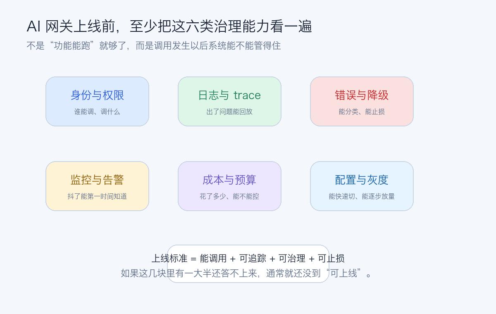

# AI 网关上线前要补齐哪些治理能力

---

前面这一组内容，我们已经把 AI 网关的主链路基本讲完了：

- 为什么要先收口调用层
- 流式输出怎么统一
- Provider 抽象怎么做
- 模型路由放在哪一层
- 超时、重试、限流怎么治理
- 错误语义怎么统一
- Token 成本怎么统计

走到这里，很多团队会有一种感觉：

> 主功能差不多了，是不是已经可以上线了？

很多时候，真正的答案是：

> 还差最后一层，也是最容易被低估的一层。

那就是治理能力。

因为一个 AI 网关，真正上线以后面对的就不只是“能不能调通模型”。

而是这些更现实的问题：

- 用户问了什么，能不能追踪
- 模型答错了，能不能回放
- 敏感数据有没有泄露风险
- 某个 provider 出问题时，能不能快速止损
- 某个模型成本飙升时，能不能及时发现

所以这篇文章，我们专门把这一层收个口：

> **AI 网关上线前，到底还要补齐哪些治理能力。**

这篇你会拿到 3 个结论：

- 为什么“功能跑通”离“可以上线”还差一整层治理能力
- AI 网关上线前最值得优先补齐的是哪几类能力
- 一份贴近真实项目的上线检查清单应该怎么看

---

## 01 先说结论：AI 网关上线，不是“功能跑通”就够了

很多团队会把上线标准理解成：

- 能调模型
- 能返回结果
- 前端能显示

这当然是最基础的。

但对企业系统来说，这还远远不够。

因为上线之后，系统真正要面对的是：

- 稳定性
- 可追踪性
- 安全性
- 可解释性
- 成本可控性

也就是说，一个能上线的 AI 网关，本质上要回答的问题不只是：

> 能不能调用模型。

还要回答：

> **调用发生以后，系统能不能管得住。**

---

## 02 第一类一定要补的，是身份、权限和调用边界

AI 网关不是一个匿名工具层。

只要进入业务系统，它就一定要知道：

- 这次请求是谁发起的
- 属于哪个租户
- 当前场景有没有权限调用某些模型
- 是否允许调用流式能力

所以第一类必须补齐的治理，就是身份和权限边界。

至少建议补这几件事：

### 1. 调用身份透传

进入网关的每次请求，至少要带：

- user id
- tenant id
- scene

### 2. 模型权限控制

不是所有人都应该能调用所有模型。

例如：

- 高成本模型只给少数业务
- 私有模型只允许内网场景

### 3. 能力权限控制

有些系统可能允许：

- chat
- stream

但不允许：

- tool call
- high-risk function

这些边界如果不上线前先立住，后面越补越难。

---

## 03 第二类最不能省的，是日志、trace 和审计回放

AI 网关一旦出问题，最怕的是：

> 只能看到“失败了”，却还原不了当时发生了什么。

所以第二类治理能力，必须围绕可追踪性来建设。

至少值得补齐下面这些内容。

### 1. trace id

每一次模型调用，最好从入口一路贯穿：

- handler
- biz
- gateway
- provider

### 2. 调用日志

至少记录：

- user
- tenant
- scene
- provider
- model
- latency
- status
- error code

### 3. 流式请求关键节点日志

不要每个 chunk 都打日志。

更适合记录：

- 流开始
- 首字时间
- 流结束
- 是否中断
- 最终 usage

### 4. 审计回放能力

如果后面要排查：

- 为什么回答错了
- 为什么调用了某个模型
- 为什么成本异常

没有足够审计信息会非常难查。

所以审计回放不是锦上添花，而是上线后非常实用的能力。

---

## 04 第三类最容易拖后的，是内容安全和敏感信息处理

只要 AI 网关开始接企业数据，这件事就必须提上日程。

要先想清楚几个问题：

- 用户输入是否可能带敏感信息
- 日志里是否会记录原始 prompt
- 模型输出是否可能包含不合规内容
- 某些场景是否必须走私有化模型

第一版未必要一上来做得很重。

但至少要补最基础的策略。

### 1. 日志脱敏策略

不要想当然把所有原始输入和输出完整打进日志。

### 2. 高敏场景模型限制

有些场景就不该走公网大模型。

### 3. 输出内容风控预留点

即使第一版先不做复杂审核，也最好预留：

- 输出检查
- 高风险词策略
- 命中后拦截或降级

---

## 05 第四类真正救命的，是告警和止损能力

AI 网关上线以后，真正可怕的不是偶尔失败。

而是：

> 出问题了，但没人第一时间知道，也没人能快速止损。

所以稳定性治理至少要补这几类能力。

### 1. 关键指标监控

例如：

- 请求量
- 成功率
- 超时率
- 限流命中率
- provider 失败率
- 首字返回时间

### 2. provider 级告警

不要只看整体成功率。

某家 provider 抖了，应该能单独看出来。

### 3. 快速降级开关

例如：

- 临时关闭某个模型
- 暂停流式能力
- 某个场景切回备用模型

如果没有快速开关，线上处理会很被动。

### 4. fallback 可观测

降级和 fallback 不能只是“内部自动做了”。

还得能看见：

- 触发了多少次
- 为什么触发
- 成本有没有上升

---

## 06 第五类迟早要补上的，是成本、配额和预算控制

前一篇我们讲了 usage 和 cost 统计。

但真要上线，仅仅“看得见花了多少钱”还不够。

通常还要继续往前补一层：

> **控制。**

例如：

- 单用户配额
- 单租户预算
- 单模型使用上限
- 超预算后的降级策略

这一层未必要第一天就做成复杂平台。

但至少要想清楚：

- 超了预算怎么办
- 是直接拒绝
- 还是切便宜模型
- 还是只允许非流式

这些都属于非常现实的上线治理。

---

## 07 第六类很容易被忽略的，是配置变更和灰度能力

AI 网关不是上线一次就不动了。

相反，它很可能是后续变动非常频繁的一层。

例如：

- 切模型
- 调价格
- 改路由
- 改超时
- 调限流

如果每次都只能改代码、重新发布，响应速度通常会不够。

所以更稳的方式是逐步补齐：

### 1. 配置集中化

例如：

- provider 配置
- model 配置
- pricing 配置
- route 配置

### 2. 灰度能力

例如：

- 某个租户先试新模型
- 某个场景先切新路由

### 3. 配置生效审计

后面出了问题，你最好能知道：

> 是不是某次配置变更导致的。

---

## 08 真准备上线时，先按这份清单过一遍

如果你现在准备把 AI 网关推向测试或生产环境，我会建议至少按这个清单过一遍。

### 调用边界

- 是否能识别 user / tenant / scene
- 是否有模型权限控制
- 是否有能力权限控制

### 稳定性

- 是否有统一超时
- 是否有统一限流
- 是否有保守重试
- 是否有 fallback 或降级策略

### 可追踪性

- 是否有 trace id
- 是否有统一日志
- 是否能记录 route result
- 是否能记录最终 usage 和 cost

### 流式链路

- 是否支持 done / error / cancel 区分
- 是否验证过代理层 buffering
- 是否记录首字时间和流结束状态

### 安全与合规

- 日志是否脱敏
- 敏感场景是否有限制
- 是否预留内容安全检查点

### 运维与止损

- 是否有关键指标监控
- 是否有 provider 告警
- 是否有快速切换开关

如果这些问题里，有一大半还答不上来，通常就意味着：

> 功能能跑，但距离“可上线”还差一层。

---

## 09 最容易被低估的一件事：解释能力

很多治理能力最后都会汇聚到一个更底层的问题：

> **系统出了结果以后，你能不能解释它为什么这么运行。**

例如：

- 为什么走了这个 provider
- 为什么重试了
- 为什么被限流了
- 为什么成本突然变高
- 为什么这次流式请求中断了

一个可上线的 AI 网关，不只是做动作。

更重要的是：

> **它的关键决策最好都能被解释。**

这会直接决定后续排障、复盘、运营和优化成本。

---

## 10 最后

AI 网关这一层，很多团队最开始都只是把它看成：

> 模型调用统一入口。

这当然没错。

但只要准备上线，它就不再只是一个“调用封装层”。

它会慢慢变成一层真正的基础设施：

- 负责路由
- 负责治理
- 负责审计
- 负责成本
- 负责止损

也正因为这样，AI 网关真正的上线标准，从来不是“调通了”。

而是：

> **能不能在真实业务系统里，被持续管理、持续观察、持续优化。**

如果你把这一组内容一路读下来，其实会慢慢看到一条很清楚的路线：

从模型调用开始，
到流式输出、Provider、路由、治理、成本、审计，
最后把一段 AI 能力，接成一套可以长期运行的系统。

这才是 Go 开发者在 AI 落地里最有价值的一部分工作。

AI 网关这一层，基本都会是最先要立住的底座。
