> 很多 AI Demo 看起来很酷，但真正上线时，权限、日志、成本、知识库、工具调用、效果评估都会变成问题。这个公众号想记录一条更实用的路径：用 Go 把 AI 应用真正接进业务系统。

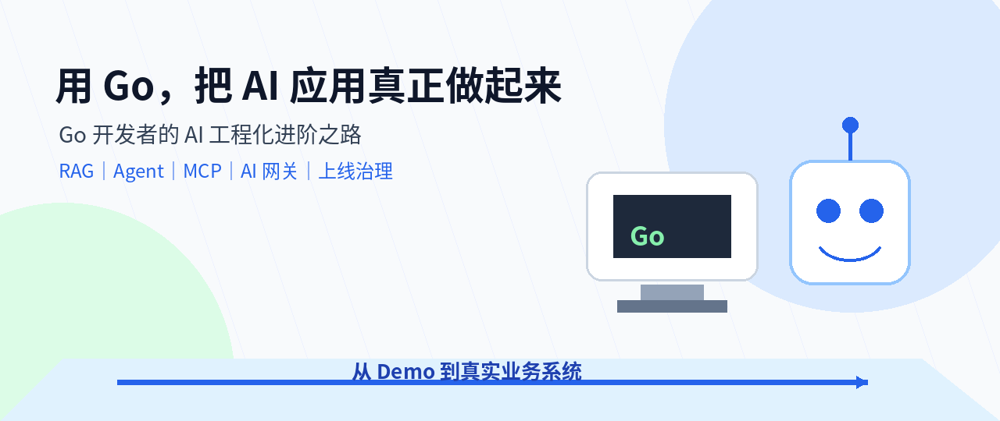

---

## 01 一个很常见的场景

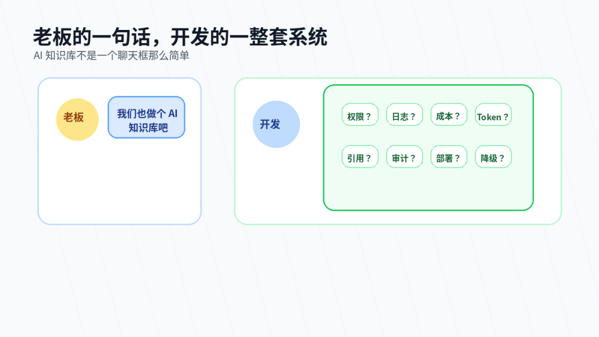

最近这两年，很多公司都在说同一句话：

> “我们也做个 AI 知识库吧。”

听起来很简单。

- 调一个大模型接口。
- 做一个聊天页面。
- 上传几个文档。
- 用户输入问题。
- AI 返回答案。

一个 Demo 很快就能跑起来。

可一旦准备放进真实业务系统，问题马上就来了。

```text
老板：我们能不能下个月上线？
开发：可以先做个 Demo。
老板：我要能查制度、查项目、查合同、查工单。
开发：那要做知识库。
老板：不同部门只能看自己的资料。
开发：那要做权限。
老板：回答要有依据，不能乱说。
开发：那要做引用来源和检索审计。
老板：成本要能统计。
开发：那要做 Token 统计和调用日志。
老板：出问题要能追责。
开发：那要做审计和回放。
```

这时候你会发现，AI 应用真正难的地方，并不只是“让模型回答一句话”。

真正难的是：

> **如何把 AI 能力稳定、安全、可追踪地接进真实业务系统。**

这就是这个公众号接下来想长期记录的方向。

---

## 02 这个公众号准备做什么

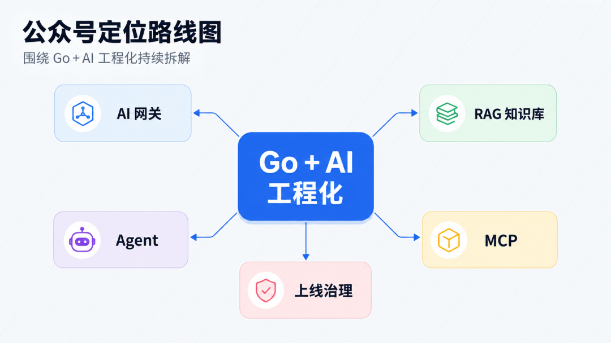

这个号后续会聚焦一个方向：

> **Go 开发者的 AI 工程化进阶之路。**

我想记录的不是简单调用接口，也不是只聊大模型概念。

我更想拆解一个后端开发者真正会遇到的问题：

> **如何用 Go 把 AI 能力做成可运行、可维护、可上线的系统。**

后续内容会围绕这些关键词展开：

| 方向 | 主要内容 |
| --- | --- |
| Go | 后端服务、接口封装、工程结构、部署运维 |
| AI 网关 | 模型调用、流式输出、限流、重试、成本统计 |
| RAG | 企业知识库、文档解析、向量检索、引用来源 |
| Agent | 工具调用、任务编排、状态管理、人工确认 |
| MCP | MCP Server、工具服务、企业系统连接 |
| 治理 | 权限、安全、日志、审计、评估、降级 |

一句话概括：

> **用 Go，把 AI 应用从“能演示”做到“能上线”。**

---

## 03 为什么是 Go + AI 工程化

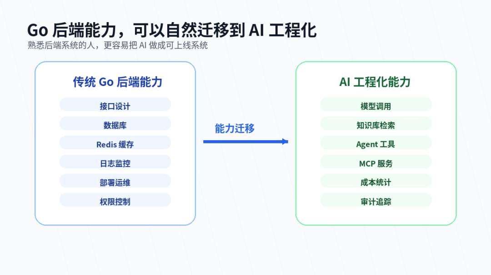

一提到 AI 开发，很多人第一反应是 Python。

Python 很适合模型训练、数据分析、算法实验。

但当 AI 能力要进入业务系统时，后端工程能力就会变得非常重要。

企业里的 AI 应用，最终会进入这些场景：

```text
企业知识库
智能客服
合同问答
制度问答
工单系统
设备运维
数据分析
代码审查
办公流程
```

这些场景需要的不只是模型能力，还需要完整的工程支撑。

- 需要接口。
- 需要鉴权。
- 需要日志。
- 需要限流。
- 需要部署。
- 需要监控。
- 需要审计。
- 需要成本统计。
- 需要异常处理。
- 需要和已有业务系统对接。

这正是 Go 开发者可以切入的地方。

- Go 适合做后端服务。
- Go 适合做网关。
- Go 适合做工具服务。
- Go 适合做高并发接口。
- Go 适合把 AI 能力封装成稳定的工程能力。

所以这个公众号不会只讲“AI 能做什么”。

更重要的是讲：

> **AI 能力到底怎么接进系统里。**

---

## 04 第一条主线：Go AI 网关

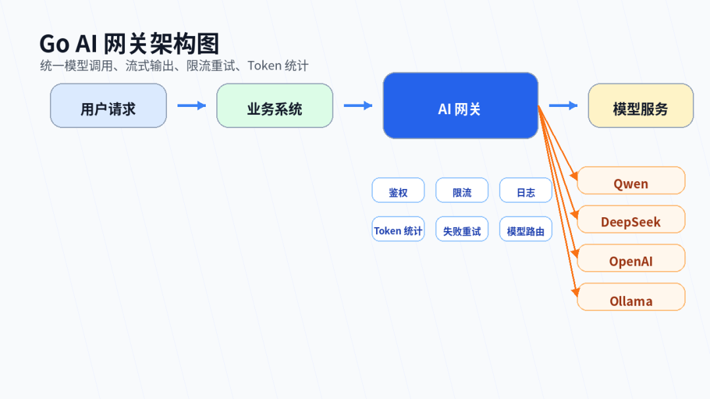

很多人第一次接大模型接口时，代码大概是这样的：

```go
resp, err := http.Post(url, "application/json", body)
if err != nil {
    return err
}
```

Demo 阶段这样写没问题。

但真实系统里，如果每个业务模块都直接调用模型接口，后面一定会越来越乱。

你会遇到这些问题：

```text
不同模型厂商接口不一样，怎么统一？
OpenAI、Qwen、DeepSeek、Ollama 怎么兼容？
用户请求超时怎么办？
模型调用失败要不要重试？
流式输出怎么返回给前端？
用户并发上来怎么限流？
每个人用了多少 Token？
每个部门花了多少成本？
模型服务挂了怎么降级？
```

所以后续会一起拆一个模块：

> **Go AI 网关。**

它可以理解为 AI 应用的“模型调用中枢”。

AI 网关要解决的问题包括：

| 模块 | 作用 |
| --- | --- |
| Provider 抽象 | 统一不同模型厂商的接口 |
| 流式输出 | 实现类似 ChatGPT 的逐字返回效果 |
| 超时控制 | 避免模型接口拖垮业务请求 |
| 失败重试 | 临时异常时自动补偿 |
| 限流熔断 | 防止高并发压垮系统 |
| Token 统计 | 统计用户、部门、项目的使用成本 |
| 调用日志 | 记录每次模型调用过程 |
| 模型路由 | 根据场景选择不同模型 |
| 降级策略 | 模型不可用时返回兜底结果 |

这个方向会从最小可用版本开始，一步步做成可以复用的 AI 调用层。

---

## 05 第二条主线：RAG 企业知识库

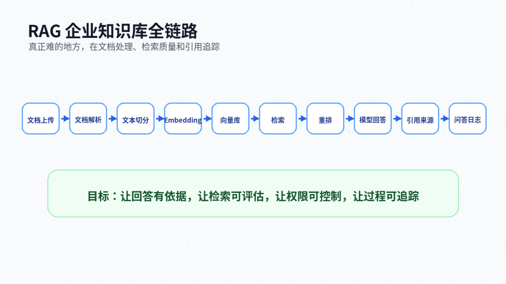

企业 AI 落地里，最常见的场景就是知识库问答。

比如：

```text
员工问制度
客服查产品资料
运维查设备手册
项目经理查历史方案
开发者查接口文档
```

看起来很简单：

> 把文档放进去，让 AI 回答问题。

但真正做起来会发现，知识库系统有大量细节。

- PDF 怎么解析？
- Word 怎么处理？
- 表格怎么保留结构？
- 文本怎么切分？
- Embedding 模型怎么选？
- 向量数据库怎么设计？
- 检索结果不准怎么办？
- 回答能不能带引用来源？
- 不同用户能不能看到不同文档？
- 文档更新后知识库怎么同步？

后续公众号会围绕一个长期项目展开：

> **用 Go 从 0 构建企业级 AI 知识库助手。**

这个项目会尽量贴近真实业务系统。

---

## 06 第三条主线：Agent 工程实践

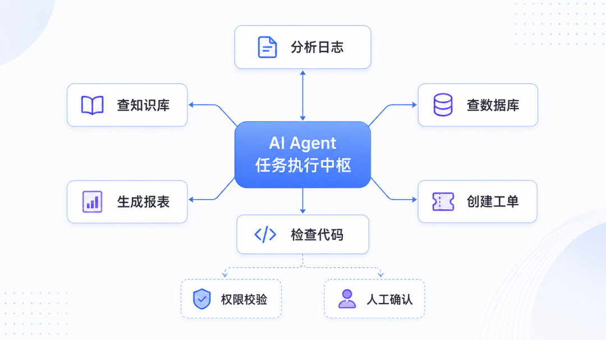

Agent 很热。

但我更关心它怎么落到业务系统里。

一个只会聊天的 Agent，价值有限。

真正有用的 Agent，应该能在规则允许的范围内调用工具，完成任务，并且留下完整记录。

比如：

```text
查知识库
查订单
查数据库
生成报表
创建工单
分析日志
检查代码
调用内部接口
```

这时后端开发者必须考虑几个问题：

- 工具怎么注册？
- 参数怎么定义？
- 权限怎么校验？
- 调用过程怎么记录？
- 失败以后怎么处理？
- 高风险操作是否需要人工确认？
- 整个执行过程能不能回放？

---

## 07 第四条主线：MCP Server

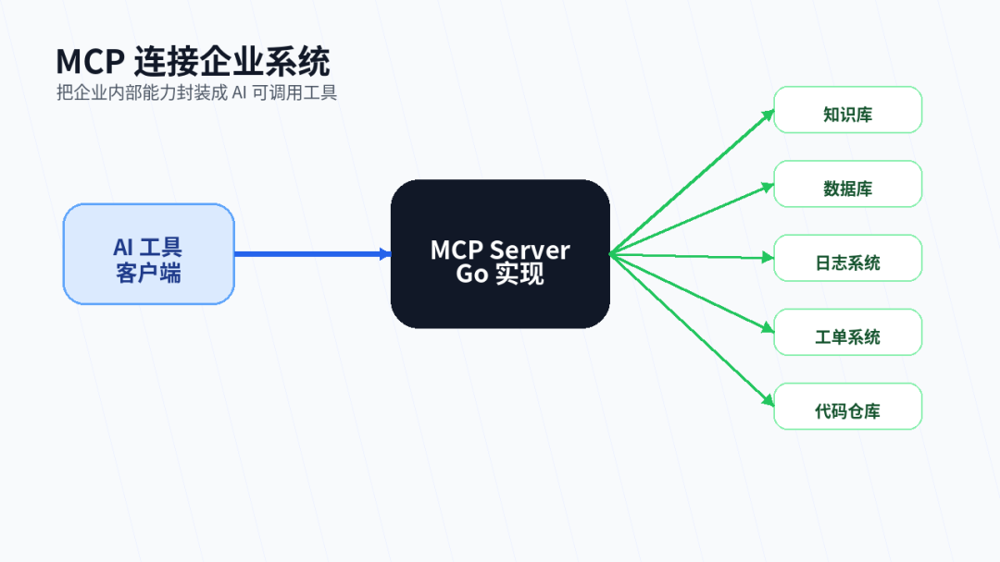

MCP 可以理解为 AI 应用连接外部工具和数据源的一种方式。

对 Go 开发者来说，MCP 很值得关注。

因为未来很多企业内部能力，都可能通过 MCP Server 暴露给 AI 工具使用。

例如：

```text
知识库查询
数据库查询
接口文档检索
日志分析
代码仓库读取
工单创建
文件处理
内部系统查询
```

---

## 08 第五条主线：AI 应用上线治理

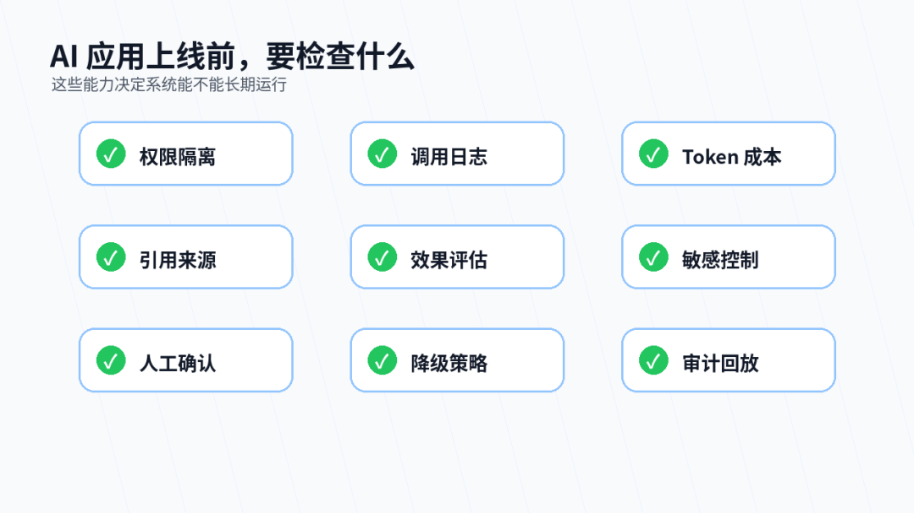

很多 AI 应用在演示阶段很顺利。

但上线以后，真正的问题才开始出现。

```text
回答错了怎么办？
模型胡说怎么发现？
数据泄露怎么防？
调用成本怎么算？
用户问了什么能不能追踪？
AI 调用了哪些工具能不能回放？
高风险操作有没有人工确认？
```

企业真正需要的 AI 应用，不只是“会聊天”。

还要做到：

> **可管理、可追踪、可评估、可控制。**

---

## 09 这个号适合谁看

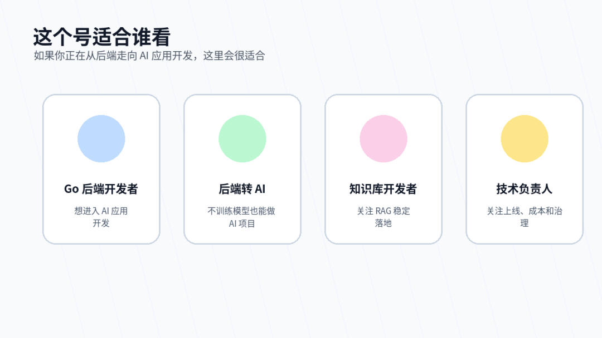

如果你是下面几类人，这个号可能会对你有帮助。

| 读者类型 | 你可能关心什么 |
| --- | --- |
| Go 后端开发者 | 如何从业务接口开发进入 AI 应用开发 |
| 后端转 AI 的开发者 | 不训练模型，也能参与 AI 项目 |
| 企业知识库开发者 | RAG 怎么做得更稳定 |
| 技术负责人 | AI 应用怎么从 Demo 走向上线 |
| Agent 爱好者 | Agent 如何接入真实业务系统 |
| MCP 关注者 | 如何用 Go 写 MCP Server |
| AI 工具使用者 | AI 写代码后怎么审查和落地 |

---

## 10 后续更新计划

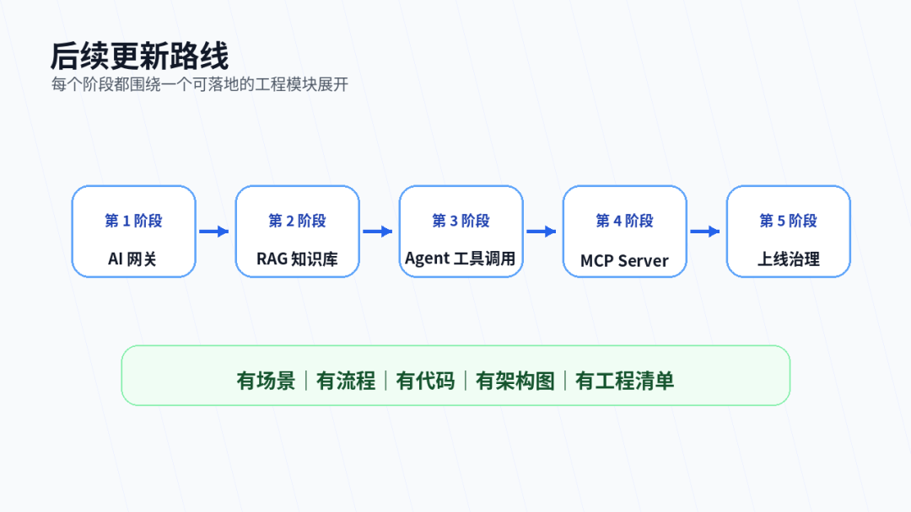

接下来会先从几个关键模块开始。

| 顺序 | 文章主题 |
| --- | --- |
| 1 | Go 后端如何封装大模型调用层 |
| 2 | 如何实现 ChatGPT 一样的流式输出 |
| 3 | 企业知识库系统的整体架构 |
| 4 | 文档上传后，后端到底要做哪些处理 |
| 5 | 用 Go 接入向量数据库 |
| 6 | RAG 回答为什么必须带引用来源 |
| 7 | Agent 工具调用怎么设计 |
| 8 | 用 Go 写一个最小 MCP Server |
| 9 | AI 网关如何统计 Token 成本 |
| 10 | AI 应用上线前要补齐哪些治理能力 |

---

## 11 公众号菜单规划

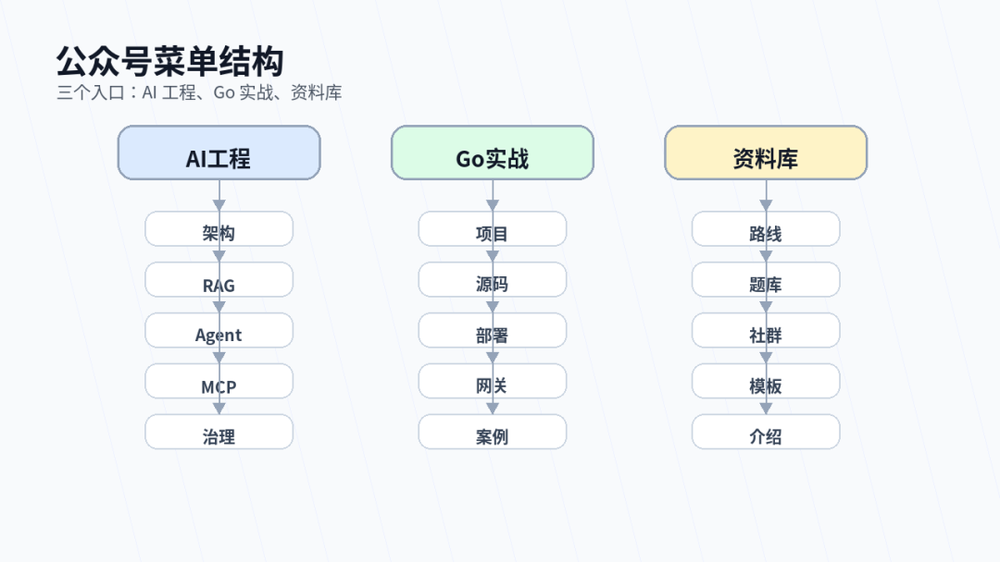

后续菜单会先按三个入口来建设。

```text
AI工程
  ├─ 架构
  ├─ RAG
  ├─ Agent
  ├─ MCP
  └─ 治理

Go实战
  ├─ 项目
  ├─ 源码
  ├─ 部署
  ├─ 网关
  └─ 案例

资料库
  ├─ 路线
  ├─ 题库
  ├─ 社群
  ├─ 模板
  └─ 介绍
```

---

## 12 最后

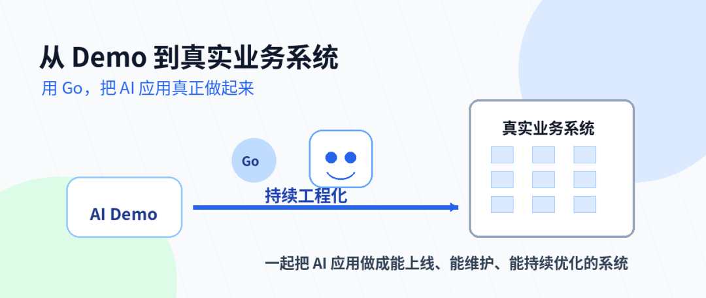

AI 正在改变软件开发，也在改变企业系统。

但对后端开发者来说，机会没有消失。

相反，AI 应用越往业务里走，越需要后端工程能力。

- 需要有人设计接口。
- 需要有人管理权限。
- 需要有人处理日志。
- 需要有人控制成本。
- 需要有人保障稳定性。
- 需要有人把 AI 能力接进真实流程。

这就是 Go 开发者可以发挥价值的地方。

从今天开始，我会在这里持续记录一条路线：

> **用 Go，把 AI 应用真正做起来。**

后续我们一起从模型调用开始，慢慢走到 RAG、Agent、MCP、AI 网关和上线治理。

把一个看起来很酷的 AI Demo，做成一个真正能上线、能维护、能持续优化的系统。

如果你也在关注这个方向，欢迎关注。

我们一起进阶。
